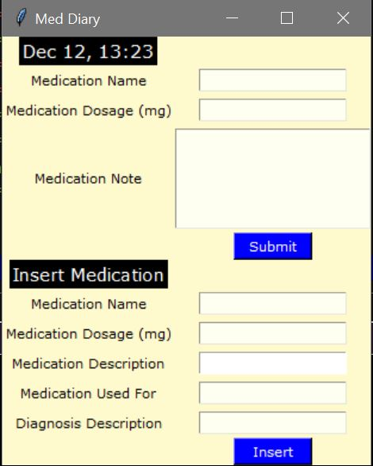

  
  <h3 align="center">Medication Diary</h3>
  

    This is a program where a user can enter his/her illness, medications and notes!

<!-- ABOUT THE PROJECT -->
## About The Project

### Built With

* Python
* Python - Tkinter
* MySQL

<!-- GETTING STARTED -->
## The Process and What I have learned

### The Process

  As a person with different diagnosis and taking different medications and supplements, 
  I found it hard to always keep my medications and health status all time. 
  I often forget the important dates for the medication, and also sometimes get confused if I took it or not! 
  And I know this happens to a lot of people, as I see lots of questions on Google such as 
  "What happens if you accidently take xxx twice?!" and so on.  
   So, here I am, I created this program so that I can use every day!

This program is very simple to use, all you need to do is,  
    1. Download the file and the database schema.  
    2. Insert your medications and diagnosis.  
    3. And add daily medication notes!

### Lesson Learned

  This was my first time using MySQL in Python. Although I previously used MySQL in website using PHP, I found this really fun!
  This project only used very simple SQL/Python queries and had a simple database structure, I had a few challenges here and there.
  Also, manipulating the interface was not so easy. I tried using different interface for Python, but somehow I always ended up with
  Tkinter. But I need to work on how to make the interface better.  
  Overall, I enjoyed the every part of this project, and one day, I wish to make a better medication diary that anyone can use!

